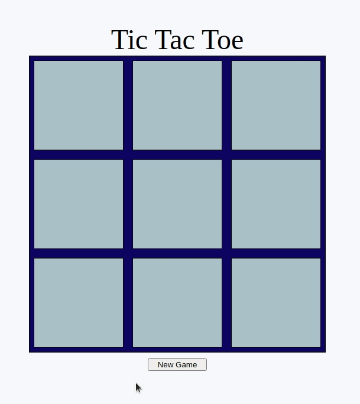
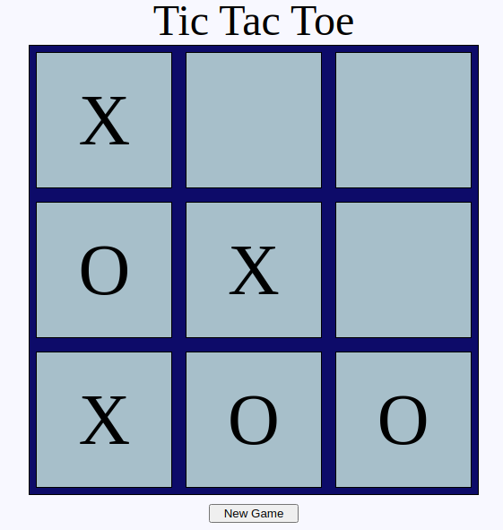

<h4 align="center">

</h4>

## Tic Tac Toe

2 Player Tic Tac Toe Game

## Description

2 player Tic Tac Toe game made with JavaScript, HTML, and CSS. Users can input names for player 1 and player 2, and when a player wins or ties a message is displayed on top of the screen with the result. 

## Why?

The purpose of this project was to practice JavaScript, HTML, and CSS, specifically containing logic in organized functions and modules. For this project I tried to minimize global variables and put all the logic into modules and factory functions. There are gameboard and gameflow modules that contain the main game logic, and player functions to create the players. It was interesting deciding where every piece of logic should go, for example making a turn function that goes in the gameplay module, and making a render board function in the gameboard module. It was also good practice for implementing conditional stateful logic that limits the potential DOM interactions, for example if a player has won then other tic tac toe squares can not be clicked, or if a square has already been selected then it can not be selected again. Styling the board was fun CSS practice to make a simple but recognizable game that looked fairly nice.

## Usage/Install

Clone/Download the project files and open index.html in browser.
